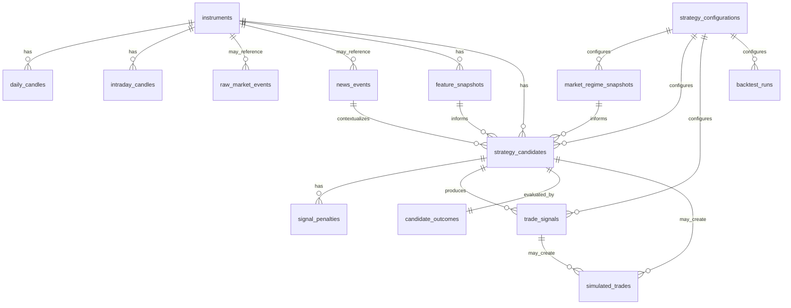

# InterSignal Database Schema

Current phase: Step 02.2 - Database Schema

The initial database design preserves InterSignal's research pipeline:

```text
RAW DATA
  -> NORMALIZED DATA
  -> DERIVED FEATURES
  -> CANDIDATES
  -> SIGNALS
  -> TRADE / PAPER TRADE
  -> OUTCOMES / ANALYTICS
```

The schema intentionally keeps these layers separate. Raw provider payloads are retained for reproducibility, normalized candles support repeatable research, derived features capture calculated state, and candidates are retained whether accepted or rejected.

## Tables

| Table | Purpose |
| --- | --- |
| `instruments` | Canonical provider-agnostic tradable instrument master. |
| `daily_candles` | Normalized end-of-day OHLCV history by instrument, date, and source. |
| `intraday_candles` | Normalized historical/live candles across intervals such as `1m`, `5m`, and `15m`. |
| `raw_market_events` | Original provider payloads/events for debugging and reproducibility. |
| `news_events` | Normalized catalyst and news records with sentiment, materiality, and freshness fields. |
| `market_regime_snapshots` | Every calculated market-regime state and its component scores. |
| `feature_snapshots` | Derived instrument features at a point in time, with extensible JSONB and selected queryable columns. |
| `strategy_candidates` | All meaningful candidates, including rejected and expired candidates. |
| `signal_penalties` | Separate penalty records so base scores are not silently overwritten. |
| `trade_signals` | Signal records generated from candidates. No broker order is placed. |
| `strategy_configurations` | Versioned JSONB configuration for future thresholds, weights, risk, and scoring settings. |
| `backtest_runs` | Reproducible research experiment metadata. Backtest execution is not implemented yet. |
| `candidate_outcomes` | Post-event labels and forward-return/risk outcomes for accepted and rejected candidates. |
| `simulated_trades` | Future research and paper-trade records. Live execution is not represented. |
| `audit_events` | System-level audit trail for future configuration changes, transitions, risk decisions, and failures. |

## Relationships



## Raw vs Normalized vs Derived Data

`raw_market_events` preserves original provider payloads without derived indicators. This is useful when a future result needs to be reproduced or a provider mapping needs debugging.

`daily_candles`, `intraday_candles`, and `news_events` store normalized records that can be queried without relying on provider-specific payload formats.

`market_regime_snapshots` and `feature_snapshots` store calculated state. These records reference configuration versions where relevant, so future research can determine which settings produced a candidate or signal.

## Candidate And Outcome Learning Loop

`strategy_candidates` retains all meaningful candidates, including `REJECTED` and `EXPIRED` rows. This is required because rejected candidates can later be evaluated in `candidate_outcomes`.

That design lets InterSignal answer questions such as:

- Was a rejection a `GOOD_REJECTION`?
- Did the system miss a `MISSED_WINNER`?
- Which penalties helped or hurt signal quality?
- Which configuration version produced better candidate outcomes?

## Configuration Versioning

`strategy_configurations` is the future home for strategy/risk settings such as price bounds, liquidity filters, regime weights, scoring weights, penalty values, confirmation windows, risk percentage, R:R thresholds, holding periods, and graduation criteria.

Step 02.2 creates the table and inserts only a safe placeholder configuration. It does not define real thresholds, weights, risk values, or trading parameters.

## RLS And Access Model

This is currently an internal/private application. The migration enables RLS on all application tables and intentionally does not add frontend write policies.

Future access principles:

- Backend/service role should write ingestion, derived features, candidates, signals, outcomes, simulated trades, configuration changes, and audit events.
- Frontend should not receive or store Supabase service-role credentials.
- Frontend should not directly write sensitive trading or research lifecycle records.
- Public/anon read policies, if needed, should be added deliberately for narrow read-only views.

## Paper And Live Separation

`simulated_trades` supports only `RESEARCH` and `PAPER` account modes. There is no `LIVE` account mode in Step 02.2. Future live broker execution should be introduced through separate provider and order-management layers with explicit auditability and risk controls.

## Migration

The SQL file is:

```text
backend/migrations/001_initial_schema.sql
```

It is directly executable in the Supabase SQL editor. It has not been applied remotely by this task.

